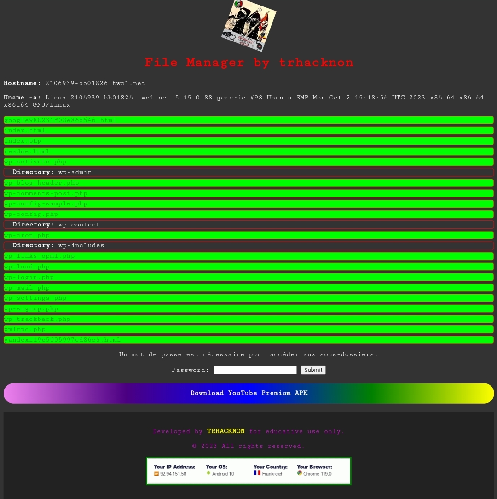

# File Manager by TRHACKNON

## Overview

Welcome to the File Manager developed by TRHACKNON. This tool provides a user-friendly interface for listing files and directories on a server. It also allows you to view the content of specific files.

## Features

- **Directory Navigation:** Easily navigate through directories and subdirectories.
- **File Listing:** View a list of files with supported extensions.
- **File Content Viewer:** Check the content of supported files.
- **Password Protection:** Secure access to subdirectories with a password.

## Getting Started

1. Clone the repository.
   ```bash
   git clone https://github.com/tucommenceapousser/dirlister
   ```

2. Upload the files to your server.

3. Ensure PHP is configured on your server.

4. Access the tool through your browser.

PASSWORD = trkntrkn

## Usage

- Open `dirlister.php` in your browser.
- Navigate through directories.
- Enter the password to access protected subdirectories.
- Click on files to view their content.

## Screenshots



## Credits

Developed by [TRHACKNON](https://github.com/trhacknon) for educational use only.

## License

This project is licensed under the [MIT License](LICENSE).
